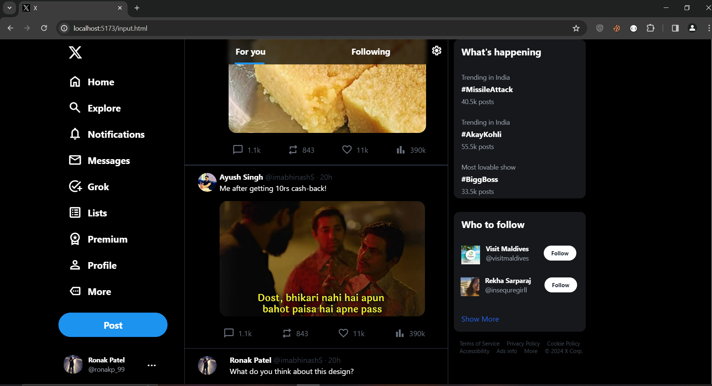

# Twitter UI Clone with Tailwind CSS

## Description
This project is a simple Twitter UI clone created using Tailwind CSS. It aims to demonstrate the use of Tailwind CSS for styling and layout purposes.

## Features
- Responsive design for various screen sizes.
- Mimics the basic layout and styling of the Twitter UI.
- Utilizes Tailwind CSS for styling.

## Screenshots

*Add more screenshots as needed.*

## Technologies Used
- HTML
- CSS (with Tailwind CSS)

## Installation
1. Clone the repository:
   ```bash
   git clone https://github.com/your-username/twitter-ui-clone.git
